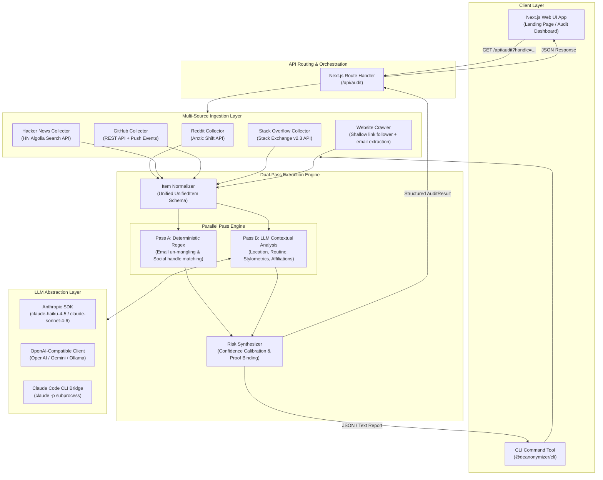

# System Architecture & Technical Specification

The **Privacy Exposure Auditor (`weblab` / `deanonymizer`)** is a monorepo application consisting of a Next.js 16 web frontend and a TypeScript OSINT inference engine package. This document details the system design, data flow, extraction algorithms, LLM abstraction layers, and API interface specifications.

---

## 1. High-Level Architecture Diagram



---

## 2. End-to-End Data Pipeline

### Step 1: Ingestion & Scraping
When an audit is triggered for a handle `H`:
1. **Reddit**: Queries post and comment history via Arctic Shift API (`https://arctic-shift.photon-reddit.com`).
2. **Hacker News**: Retrieves stories and comments matching the username via Algolia search (`https://hn.algolia.com/api`).
3. **GitHub**: Fetches public events (`/users/{username}/events/public`), issue comments, and commit author names/emails embedded within `PushEvent` payloads.
4. **Stack Overflow**: Queries user answers, questions, and profile metadata via Stack Exchange API v2.3 (`https://api.stackexchange.com`).
5. **Website Crawler**: If GitHub or Stack Overflow profile URLs link to personal websites, a link-follower fetches the home page and up to 5 sub-pages (prioritizing `/about`, `/cv`, `/contact`, `/resume`, `/bio`, `/me`). `mailto:` hrefs and links are extracted prior to HTML strip-down.

### Step 2: Schema Normalization
Raw payloads from all platforms are mapped to a uniform item shape (`UnifiedItem`):
```typescript
interface UnifiedItem {
  id: string;
  platform: 'reddit' | 'hn' | 'github' | 'stack_overflow' | 'website';
  author: string;
  body: string;
  title?: string;
  context?: string;      // Subreddit, repo name, story title
  createdUtc: number;     // Standardized UTC timestamp
  permalink: string;      // Direct verifiable evidence URL
}
```

### Step 3: Dual-Pass Extraction

#### Pass A: Deterministic Regex Pass
- **Un-mangled Email Extraction**: Parses text and href attributes using pattern matching to resolve obfuscation techniques such as `john [at] domain [dot] com`, `jane (at) gmail.com`, etc. Filter logic ignores `@users.noreply.github.com` addresses.
- **Cross-Platform Social Handle Detection**: Scans URLs and `@handle` citations across 12+ social networks (LinkedIn, Twitter/X, Bluesky, Telegram, Instagram, YouTube, Reddit, Hacker News, Stack Overflow, GitHub, GitLab, Mastodon). Excludes the handle currently under audit.

#### Pass B: LLM Contextual Pass
- The normalized transcript corpus is chunked and analyzed by an LLM backend client.
- Extracts soft privacy leaks:
  - **Location / Timezone**: Self-disclosed cities, regions, local landmarks, UTC timestamp clustering.
  - **Employers & Educational Background**: Current/past companies, universities, degrees.
  - **Schedule & Routine**: Work hours, timezone active windows, weekend activity patterns.
  - **Stylometric Fingerprint**: Syntax markers, technical jargon, dialect preferences.
- **Evidence Binding**: Every claim returned by the LLM must include an exact snippet quote (`quote`) and a verifiable source permalink (`permalink`).

### Step 4: Risk Synthesis & Calibration
The engine merges direct identifier leaks with LLM findings and categorizes risk into three levels:
- **High Risk (Score ≥ 80)**: Direct identity links (un-mangled emails, exact name disclosures, personal site cross-links).
- **Moderate Risk (Score 60–79)**: Specific location/employer disclosures, active timezone window matching, community concentration.
- **Low Risk (Score < 60)**: Broad technical vocabulary, general syntax entropy markers.

---

## 3. LLM Abstraction Layer (`backend/deanonymizer/src/llm`)

The system uses a unified LLM client interface (`LLMClient`) to support seamless provider switching:

```typescript
export interface LLMClient {
  providerName: string;
  analyzeCorpus(prompt: string, maxTokens?: number): Promise<string>;
}
```

### Provider Mechanics:
1. **Anthropic Native SDK (`anthropic.ts`)**:
   - Uses `@anthropic-ai/sdk`.
   - Default model: `claude-haiku-4-5` (override via `ANTHROPIC_MODEL`).
   - Uses Anthropic Native Prompt Caching (`cache_control: { type: 'ephemeral' }`) for fast, cost-effective re-analysis of long transcripts.

2. **OpenAI-Compatible Client (`openai.ts`)**:
   - Uses `openai` SDK.
   - Compatible with OpenAI (`gpt-4o-mini`), Google Gemini (via OpenAI compatibility endpoint), Groq, Together AI, or local Ollama.
   - Leverages `response_format: { type: "json_object" }` where supported, with JSON fallback repair.

3. **Claude Code CLI Bridge (`claude-code.ts`)**:
   - Zero API key dependency. Shells out directly to local `claude -p` binary.
   - Ideal for developers with active Claude Code credentials who prefer not to manage individual API keys in their shell environment.

---

## 4. Next.js Web Application & API Route Specification

### Web App Components Structure
- **Navbar (`components/Navbar.js`)**: Top navigation bar with project status indicators.
- **Hero (`components/Hero.js`)**: Input form accepting user handles (`u/username` or `username`) with background Three.js WebGL animation.
- **Beams (`components/Beams.js`)**: Real-time 3D particle and light beam background implemented using `@react-three/fiber` and `three`.
- **RiskReportCard (`components/RiskReportCard.js`)**: Detailed visual cards displaying risk findings, confidence percentages, evidence quotes, permalinks, and specific remediation guidelines.
- **Audit API (`app/api/audit/route.js`)**: Serverless route handler executing Reddit data collection, direct regex extraction, LLM pass integration, and fallback heuristic synthesis.

### API Endpoint Reference: `GET /api/audit`

#### Request Parameters
| Parameter | Type | Required | Description |
|-----------|------|----------|-------------|
| `handle` / `username` | String | Yes | Handle or URL of the user to audit (e.g. `aarav_dev` or `https://reddit.com/user/aarav_dev`) |

#### Example Response Schema (`200 OK`)
```json
{
  "handle": "aarav_dev",
  "itemCount": 42,
  "overallRisk": "high",
  "overallScore": 86,
  "summary": "Discovered 1 direct email disclosure and 2 cross-platform social handle correlations across 42 items.",
  "identity": {
    "exactUser": "aarav_dev",
    "rationale": "Handle matched across Reddit and personal GitHub portfolio.",
    "publicProofUrls": ["https://www.reddit.com/user/aarav_dev"]
  },
  "directIdentifiers": {
    "emails": ["aarav.dev@example.com"],
    "socialHandles": [
      {
        "platform": "GitHub",
        "handle": "aarav-codes",
        "url": "https://github.com/aarav-codes"
      }
    ]
  },
  "findings": [
    {
      "id": "result-1",
      "number": 1,
      "title": "Result 1: Un-mangled Email Address Exposure",
      "confidenceScore": 96,
      "riskLevel": "High Risk",
      "color": "text-rose-600",
      "bgColor": "bg-rose-50",
      "borderColor": "border-rose-200",
      "badgeColor": "bg-rose-100 text-rose-800 border-rose-200",
      "category": "Direct Identifier Unmangling",
      "description": "Public activity contains un-obfuscated email address (aarav.dev@example.com).",
      "evidenceSnippet": "aarav.dev@example.com",
      "source": "Direct Regex Pass",
      "remediation": "Remove or redact comments containing personal email addresses from public posts."
    }
  ],
  "fetchError": null
}
```

---

## 5. Security, Ethics & Threat Model Boundaries

1. **Explicit Authorization Check**:
   The CLI includes an interactive prompt requiring explicit confirmation that the user is running the audit on their own handle or on a target who authorized the audit (`--i-am-authorized` flag bypasses prompt for automated CI runs).

2. **Public-Only Access Scope**:
   The engine only inspects data accessible to an unauthenticated passive observer. It never bypasses authentication, private APIs, or login paywalls.

3. **No Target Tracking**:
   The web platform performs transient processing and does not store or sell audited profile histories or target user footprints.
